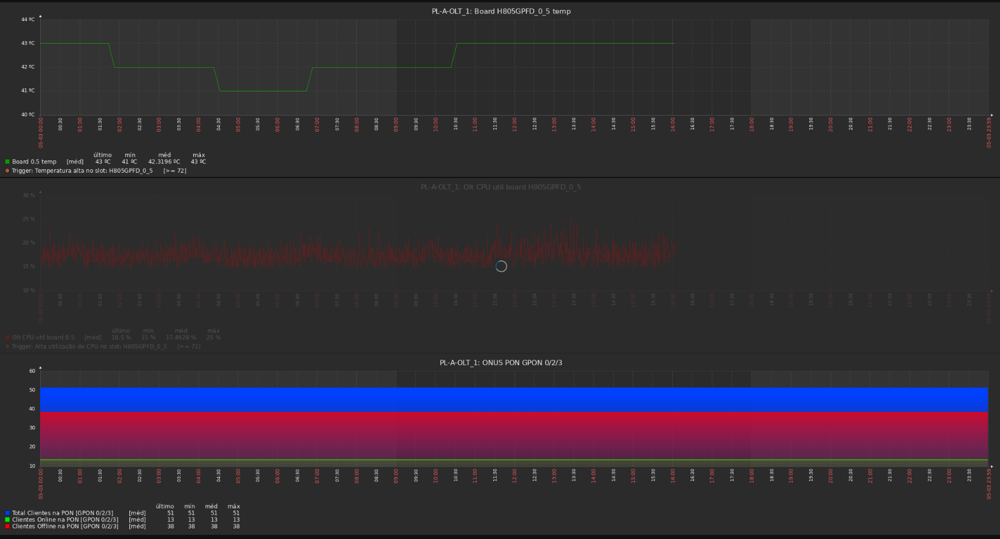

# Template Zabbix para monitorar OLT Huawei


Elements in beautiful READMEs include, but are not limited to: images, screenshots, GIFs, text formatting, etc.

## Requisitos

- Zabbix Sender
- PHP
- SNMP
- Composer 

## Instalando

- Adicione os arquivos na pasta dos externalscripts (default /usr/lib/zabbix/externalscript).
- Importe os Templates.
- Adicione os Templates ao Host.


## DEBUG

- Dependendo da versão do snmpwalk, a saída das mib podem ser diferentes, aí tem que alterar algumas linhas no código linhas

```$index = substr($keys[$i], 49, 10);```





